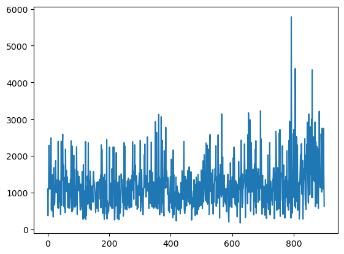

``` python
from fastcore.all import *
import numpy as np
import torch
import random
import time
```

<!-- WARNING: THIS FILE WAS AUTOGENERATED! DO NOT EDIT! -->

``` python
from torch import nn, optim
```

``` python
import torch.nn.functional as F
```

``` python
import numpy as np
import random
class Game2048:
    def __init__(self):
        self.size = 4
        self.score = 0
        self.board = np.zeros((self.size, self.size), dtype=int)
        self.add_new_tile()
        self.add_new_tile()
        self.nomove = False
    def add_new_tile(self):
        empty_tiles = list(zip(*np.where(self.board == 0)))
        if empty_tiles:
            x, y = random.choice(empty_tiles)
            self.board[x][y] = 2 if random.random() < 0.9 else 4
    def move(self, direction):
        self.nomove = False
        prev_board = self.board.copy()
        if direction == 'down':
            self.board = np.rot90(self.board, -1)
            self._move_left()
            self.board = np.rot90(self.board)
        elif direction == 'up':
            self.board = np.rot90(self.board, 1)
            self._move_left()
            self.board = np.rot90(self.board, -1)
        elif direction == 'left':
            self._move_left()
        elif direction == 'right':
            self.board = np.fliplr(self.board)
            self._move_left()
            self.board = np.fliplr(self.board)
        self.nomove = np.abs(self.board - prev_board).sum()==0
        if self.nomove: return
        self.add_new_tile()
    def _move_left(self):
        self.reward = 0
        new_board = np.zeros((self.size, self.size), dtype=int)
        for i in range(self.size):
            row = self.board[i][self.board[i] != 0]
            new_row = []
            skip = False
            for j in range(len(row)):
                if skip:
                    skip = False
                    continue
                if j + 1 < len(row) and row[j] == row[j + 1]:
                    new_row.append(row[j] * 2)
                    self.score += row[j]*2
                    self.reward += row[j]*2
                    skip = True
                else:
                    new_row.append(row[j])
            new_board[i, :len(new_row)] = new_row
        self.board[:] = new_board
    def is_game_over(self):
        if not np.any(self.board == 0):
            for i in range(self.size):
                for j in range(self.size - 1):
                    if self.board[i][j] == self.board[i][j + 1] or \
                        self.board[j][i] == self.board[j + 1][i]:
                        return False
            return True
        return False
game = Game2048()
print(game.board)
```

    [[0 0 0 0]
     [2 0 0 0]
     [0 0 0 0]
     [0 0 0 2]]

``` python
class ConvBlock(torch.nn.Module):
    def __init__(self, input_dim, output_dim):
        super(ConvBlock, self).__init__()
        d = output_dim // 4
        self.conv1 = nn.Conv2d(input_dim, d, 1, padding='same')
        self.conv2 = nn.Conv2d(input_dim, d, 2, padding='same')
        self.conv3 = nn.Conv2d(input_dim, d, 3, padding='same')
        self.conv4 = nn.Conv2d(input_dim, d, 4, padding='same')

    def forward(self, x):
        x = x.to(device)
        output1 = self.conv1(x)
        output2 = self.conv2(x)
        output3 = self.conv3(x)
        output4 = self.conv4(x)
        return torch.cat((output1, output2, output3, output4), dim=1)

class DQN(torch.nn.Module):

    def __init__(self):
        super(DQN, self).__init__()
        self.conv1 = ConvBlock(16, 2048)
        self.conv2 = ConvBlock(2048, 2048)
        self.conv3 = ConvBlock(2048, 2048)
        self.dense1 = nn.Linear(2048 * 16, 1024)
        self.dense2 = nn.Linear(1024, 4)
    
    def forward(self, x):
        x = x.to(device)
        x = F.relu(self.conv1(x))
        x = F.relu(self.conv2(x))
        x = F.relu(self.conv3(x))
        x = nn.Flatten()(x)
        x = F.dropout(self.dense1(x))
        return self.dense2(x)
```

``` python
def mse_loss(pred, goal):
    return torch.mean((pred-goal)**2)
```

``` python
def flatten(lst):
    return torch.tensor(lst).view(1, 4, 4)
mapping = {2**i: i for i in range(1, 16)}
mapping[0] = 0
def get_state(game):
    states = []
    for move in ['down', 'left', 'up', 'right']:
        new_game = Game2048()
        new_game.board = game.board.copy()
        new_game.move(move)
        states.append(flatten([[mapping[int(item)] for item in row] for row in game.board])) 
    states.append(flatten([[mapping[int(item)] for item in row] for row in game.board]))
    data = torch.stack(states, dim=1)
    return F.one_hot(data, 16).view(1, 80, 4, 4).float()
```

``` python
device= 'mps'
d = DQN()
d.to(device)
data = get_state(Game2048())
```

``` python
game = Game2048()
```

``` python
d(data)
```

    2.7 ms ± 758 μs per loop (mean ± std. dev. of 7 runs, 100 loops each)

``` python
d(data)
```

    tensor([[-0.0463,  0.0449, -0.0162, -0.0287]], device='mps:0',
           grad_fn=<LinearBackward0>)

``` python
from IPython.display import *
```

``` python
import matplotlib.pyplot as plt
```

``` python
clear_output
```

    <function IPython.core.display_functions.clear_output(wait=False)>

``` python
class ConvBlock(torch.nn.Module):
    def __init__(self, input_dim, output_dim):
        super(ConvBlock, self).__init__()
        d = output_dim // 4
        self.conv1 = nn.Conv2d(input_dim, d, 1, padding='same')
        self.conv2 = nn.Conv2d(input_dim, d, 2, padding='same')
        self.conv3 = nn.Conv2d(input_dim, d, 3, padding='same')
        self.conv4 = nn.Conv2d(input_dim, d, 4, padding='same')

    def forward(self, x):
        x = x.to(device)
        output1 = self.conv1(x)
        output2 = self.conv2(x)
        output3 = self.conv3(x)
        output4 = self.conv4(x)
        return torch.cat((output1, output2, output3, output4), dim=1)

class DQN(torch.nn.Module):

    def __init__(self):
        super(DQN, self).__init__()
        self.conv1 = ConvBlock(80, 256)
        self.conv2 = ConvBlock(256, 256)
        self.conv3 = ConvBlock(256, 512)
        self.dense1 = nn.Linear(512 * 16, 512)
        self.dense2 = nn.Linear(512, 4)
    
    def forward(self, x):
        x = x.to(device)
        x = F.relu(self.conv1(x))
        x = F.relu(self.conv2(x))
        x = F.relu(self.conv3(x))
        x = nn.Flatten()(x)
        x = F.dropout(self.dense1(x))
        return self.dense2(x)
```

``` python
class FullyConnectedQNetwork(nn.Module):
    def __init__(self, nin=80, nout=4):
        super().__init__()
        self.model = nn.Sequential(
            nn.Linear(nin, 192),
            nn.ReLU(),
            nn.Linear(192, 64),
            nn.ReLU(),
            nn.Linear(64, 64),
            nn.ReLU(),
            nn.Linear(64, nout)
        )
    def forward(self, x):
        return self.model(x)
```

### Must implement experience replay

``` python
replay_memory = []
max_length = 10000
```

``` python
device = 'mps'
episodes = 30
epsilons = np.geomspace(1, 0.01, episodes)
model = DQN()
model.to(device)
optimizer = optim.Adam(model.parameters(), lr=0.002)
gamma = 0.985
games_each_round = 50
avgs = []
stds = []
for epoch in range(episodes):
    experience_pool = []
    rewards = []
    if epoch % 5 == 0:
        experience_pool = experience_pool[5*batch_size:]
    t0 = time.time()
    for game_round in range(games_each_round):
        t1 = time.time()
        game = Game2048()
        while not game.is_game_over():
            state = get_state(game)
            if np.random.rand() > epsilons[epoch]:
                action = int(model(state).argmax())
            else:
                action = random.randint(0, 3)
            game.move(['down', 'left', 'up', 'right'][action])
            next_state = get_state(game)
            if game.nomove:
                reward = -20
            else:
                reward = game.reward
            if not game.is_game_over():
                replay_memory.append((state, action, reward, next_state))
            assert state.shape[1]==80
            """
            with torch.no_grad():
                target = reward + gamma*model(next_state).max()*(not game.is_game_over())
            
            experience_pool.append((state, action, target))
            """
        avgs.append(game.score)
        t2 = time.time()
    clear_output(wait=True)
    plt.plot(avgs)
    plt.show()
    batch_size = 8192
    if len(replay_memory) <= batch_size*3:
        continue
    """
    if len(replay_memory) > max_length:
        replay_memory.pop(0)
    """
    pool = random.sample(replay_memory, batch_size)
    states, actions, rewards, next_states = zip(*pool)
    
    X = torch.stack(states)
    X = X.squeeze(1)
    N = torch.stack(next_states).squeeze(1)
    y = torch.tensor(rewards, device=device) + gamma*model(N).max()
    q_values = model(X)
    try:
        chosen_q_values = q_values.gather(1, torch.tensor(actions).unsqueeze(1).to(device))
    except Exception:
        import pdb; pdb.set_trace()
    loss = mse_loss(chosen_q_values.squeeze(), y)
    optimizer.zero_grad()
    loss.backward()
    optimizer.step()
```



    KeyboardInterrupt: 
    ---------------------------------------------------------------------------
    KeyboardInterrupt                         Traceback (most recent call last)
    Cell In[145], line 23
         21 state = get_state(game)
         22 if np.random.rand() > epsilons[epoch]:
    ---> 23     action = int(model(state).argmax())
         24 else:
         25     action = random.randint(0, 3)

    KeyboardInterrupt: 

``` python
random.sample?
```

    Signature: random.sample(population, k, *, counts=None)
    Docstring:
    Chooses k unique random elements from a population sequence or set.

    Returns a new list containing elements from the population while
    leaving the original population unchanged.  The resulting list is
    in selection order so that all sub-slices will also be valid random
    samples.  This allows raffle winners (the sample) to be partitioned
    into grand prize and second place winners (the subslices).

    Members of the population need not be hashable or unique.  If the
    population contains repeats, then each occurrence is a possible
    selection in the sample.

    Repeated elements can be specified one at a time or with the optional
    counts parameter.  For example:

        sample(['red', 'blue'], counts=[4, 2], k=5)

    is equivalent to:

        sample(['red', 'red', 'red', 'red', 'blue', 'blue'], k=5)

    To choose a sample from a range of integers, use range() for the
    population argument.  This is especially fast and space efficient
    for sampling from a large population:

        sample(range(10000000), 60)
    File:      /opt/anaconda3/envs/deep/lib/python3.10/random.py
    Type:      method
